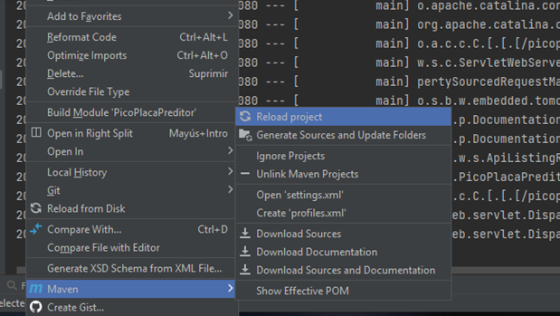
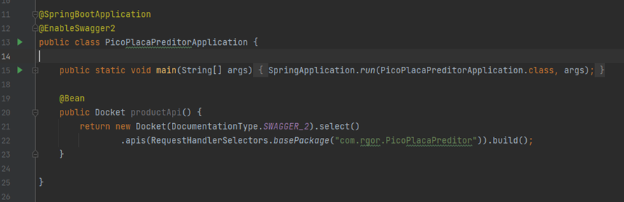
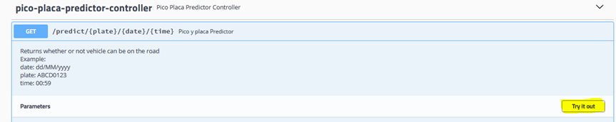
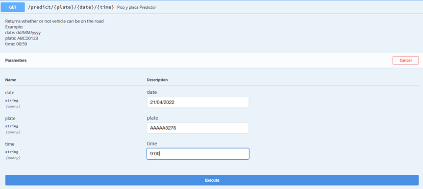

# PicoPlacaPredictor
Pico Placa Predictor API
This is  a maven api build whit Java, Spring boot and Swagger

# Install

To install local api follow the following steps
1. Clone the Project
2. Rigth click to pom.xml file and maven/Reload Project

3. When finish update dependencies, run main class of Spring boot  project  PicoPlacaPreditorApplication.java

4. Finally Go to URL http://localhost:8080/picoplacapredictor/swagger-ui.html and Test

